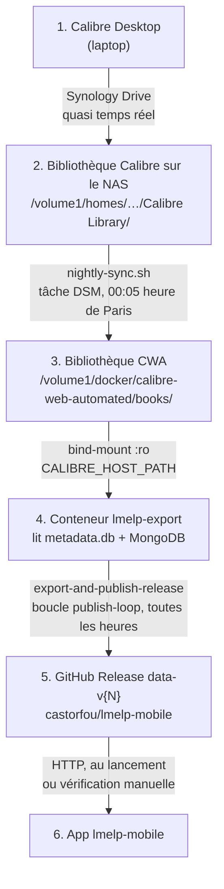

# De Calibre à l'app mobile

Cette page décrit le trajet complet d'une donnée de lecture (livre lu, en cours, note…) depuis Calibre Desktop jusqu'à l'application mobile `lmelp-mobile`. Chaque maillon a sa configuration, son déclencheur et son log. Quand l'app ne voit pas un changement fait dans Calibre, c'est ici qu'on cherche lequel a lâché.

## Vue d'ensemble



| Maillon | Où se configure-t-il ? | Déclencheur | Log |
|---|---|---|---|
| 1 → 2 | Client Synology Drive (laptop) | Continu | Client Synology Drive |
| 2 → 3 | `scripts/nas/nightly-sync.sh` + tâche DSM | Tâche planifiée DSM, 00:05 (heure de Paris) | `/volume1/docker/calibre-web-automated/rsync-nightly.log` |
| 3 → 4 | `CALIBRE_HOST_PATH` dans `.env.nas` | Montage permanent | — |
| 4 → 5 | Image `ghcr.io/castorfou/lmelp-mobile-export`, `GH_TOKEN`, `PUBLISH_INTERVAL` | Boucle interne `publish-loop`, au démarrage puis toutes les heures | `${LMELP_EXPORT_LOG_PATH}/publish-data-release.log`, notifications ntfy |
| 5 → 6 | App `lmelp-mobile` | Lancement de l'app, bouton « Vérifier les mises à jour » | — |

## Les maillons en détail

### 1 → 2 : Synology Drive

Le client Synology Drive du laptop synchronise le dossier `Calibre Library` vers le NAS, dans `/volume1/homes/guillaume/Backup/framework/home/guillaume/Calibre Library/`. La synchronisation est quasi immédiate. Ce maillon est rarement en cause, mais le laptop doit avoir été allumé et connecté après les modifications.

### 2 → 3 : `nightly-sync.sh`

Calibre-Web-Automated (CWA) dispose de sa propre copie de la bibliothèque, dans `/volume1/docker/calibre-web-automated/books/`. Le script [`scripts/nas/nightly-sync.sh`](https://github.com/castorfou/docker-lmelp/blob/main/scripts/nas/nightly-sync.sh) la met à jour :

1. il vérifie que le conteneur `calibre-web-automated` tourne (sinon il s'arrête sans rien synchroniser, car la situation est anormale) ;
2. il vérifie que les dossiers source et destination existent ;
3. il arrête CWA et vérifie qu'il est bien arrêté ;
4. il lance `rsync -av --checksum --exclude='.caltrash/'` de la bibliothèque Calibre vers `books/` ;
5. il redémarre CWA, ce qui relance le calcul des checksums KOReader. Si rsync échoue, CWA est tout de même redémarré avant que le script ne sorte en erreur.

Chaque étape est journalisée dans `rsync-nightly.log`, qui n'a pas de rotation automatique. Les erreurs s'affichent aussi dans le détail d'exécution du Planificateur de tâches DSM.

**Variables** (les valeurs par défaut sont celles du NAS) :

| Variable | Valeur par défaut |
|---|---|
| `CALIBRE_SOURCE_PATH` | `/volume1/homes/guillaume/Backup/framework/home/guillaume/Calibre Library` |
| `CWA_BOOKS_PATH` | `/volume1/docker/calibre-web-automated/books` |
| `CWA_CONTAINER` | `calibre-web-automated` |
| `NIGHTLY_SYNC_LOG` | `/volume1/docker/calibre-web-automated/rsync-nightly.log` |

**Planification** : Panneau de configuration DSM → Planificateur de tâches → Créer → Tâche planifiée → Script défini par l'utilisateur.

- Utilisateur : `root`
- Planification : tous les jours à **00:05**
- Commande :

    ```bash
    bash /volume1/docker/docker-lmelp/scripts/nas/nightly-sync.sh
    ```

Adaptez le chemin à l'emplacement où le dépôt `docker-lmelp` est cloné sur le NAS. Une copie du script à un autre emplacement fonctionne aussi, à condition de la tenir à jour.

!!! note "Fuseau horaire"
    Le Planificateur de tâches DSM utilise le fuseau du NAS (Europe/Paris) : 00:05 correspond à 22:05 UTC en été et à 23:05 UTC en hiver.

### 3 → 4 : montage `CALIBRE_HOST_PATH`

Dans `.env.nas` :

```bash
CALIBRE_HOST_PATH=/volume1/docker/calibre-web-automated/books
```

`docker-compose.yml` monte ce dossier en lecture seule sur `/calibre` dans `lmelp-export`, et `LMELP_CALIBRE_DB=/calibre/metadata.db`. C'est un bind-mount direct : le conteneur voit `metadata.db` exactement tel qu'il est sur le disque au moment de la lecture, sans délai propre à ce maillon.

`lmelp-export` lit donc la bibliothèque **CWA**, pas directement la bibliothèque Calibre synchronisée par Synology Drive. Tant que `nightly-sync.sh` n'est pas passé, l'export ne voit pas les modifications de Calibre.

### 4 : conteneur `lmelp-export`

Image `ghcr.io/castorfou/lmelp-mobile-export`, construite depuis `Dockerfile.export` du dépôt `lmelp-mobile`. Deux commandes sont disponibles :

- `export-and-publish-release` : exporte MongoDB et Calibre vers SQLite (`lmelp.db`), calcule le `content_hash` et publie sur GitHub Release si le contenu a changé ;
- `export-and-push` : export et envoi direct vers un téléphone branché en USB via ADB (voir [Export vers Android](export-android.md)).

**Déclenchement automatique** : l'entrypoint de l'image lance en arrière-plan la boucle `publish-loop`, qui exécute `export-and-publish-release` dès le démarrage du conteneur, puis toutes les `PUBLISH_INTERVAL` secondes.

| Variable | Défaut | Rôle |
|---|---|---|
| `PUBLISH_INTERVAL` | `3600` | Secondes entre deux exports. `0` désactive la boucle : la publication ne se fait plus qu'à la main. |
| `NTFY_SERVER_URL` | `https://ntfy.sh` si vide | Serveur ntfy, partagé avec le back-office. |
| `NTFY_TOPIC` | vide | Topic ntfy, partagé avec le back-office. Vide : aucune notification. |
| `LMELP_EXPORT_STATE_PATH` | `./data/logs/lmelp-export-state` | Dossier hôte monté sur `/var/lib/lmelp-export`, qui contient `last_status`. |

L'intervalle part de la fin de l'export précédent et du démarrage du conteneur : l'export n'a pas de minute fixe. Chaque recréation du conteneur (mise à jour Watchtower, redéploiement de la stack) déclenche un export immédiat.

Un seul export tourne à la fois : un `docker exec … export-and-publish-release` lancé pendant un passage de la boucle (ou l'inverse) s'arrête aussitôt avec `Publication déjà en cours, run ignoré`, sans erreur.

**Notifications ntfy** : quand `NTFY_TOPIC` est renseigné, `lmelp-export` publie sur le même topic que le back-office, avec des titres préfixés `lmelp-mobile - ` :

- à chaque publication réelle, avec les compteurs et leur écart avec la release précédente (`312 émissions (+1) · 2104 livres (+5) …`) ;
- au **premier** échec, avec les 20 dernières lignes du log. Les échecs suivants restent silencieux ;
- au retour à la normale (« publication des données rétablie »).

Un export qui ne trouve aucun changement ne notifie rien. Une notification qui échoue (serveur injoignable) ne bloque jamais la publication.

Le dernier statut (`ok` ou `failed`) est écrit dans `/var/lib/lmelp-export/last_status`, sur le volume `LMELP_EXPORT_STATE_PATH`. Il survit donc à une recréation du conteneur : une panne commencée avant une mise à jour Watchtower donne bien lieu à la notification de rétablissement après. Un fichier absent vaut `ok`.

**Exécution manuelle**, à tout moment :

```bash
docker exec lmelp-export export-and-publish-release
```

**Publication conditionnelle** : si le `content_hash` du contenu exporté est identique à celui de la dernière release, la publication est ignorée et le log indique `Contenu inchangé depuis le dernier export (version=…), publication ignorée`. Un export qui tourne sans rien publier est donc normal quand rien n'a changé, mais c'est aussi le symptôme d'une bibliothèque CWA périmée.

### 4 → 5 : GitHub Release

- Dépôt : `castorfou/lmelp-mobile`
- Tag : `data-v{N}`, où `N` est la version du schéma Room courant (`ROOM_VERSION`). Chaque version de l'app télécharge le tag de son propre schéma ; quand le schéma évolue, un nouveau tag apparaît (par exemple `data-v9`).
- Assets : `lmelp.db` et `metadata.json` (`export_date`, `export_version`, `content_hash`, `sha256`, compteurs).
- Prérequis : `GH_TOKEN` avec la permission `Contents: Read and write` sur ce dépôt (voir [Export vers Android › GH_TOKEN](export-android.md#configuration-requise-gh_token)).

### 5 → 6 : app mobile

L'app compare la version de sa base locale (`db_metadata`) à l'`export_version` de la release distante, et télécharge la nouvelle base si elles diffèrent. La vérification a lieu silencieusement au lancement, ou manuellement via le bouton « Vérifier les mises à jour » de l'écran À propos. Aucune action n'est requise côté NAS.

## Délai entre Calibre et l'app

!!! note "Au plus un intervalle après `nightly-sync.sh`"
    `lmelp-export` exporte ce que contient la bibliothèque CWA au moment où il tourne. Une modification faite dans Calibre atteint la release au premier passage de la boucle qui suit la fin de `nightly-sync.sh`, soit **au plus `PUBLISH_INTERVAL` (1 h par défaut) après**. L'ordre entre les deux planifications n'a pas d'importance.

    Pour publier tout de suite après une synchronisation manuelle, lancez `docker exec lmelp-export export-and-publish-release` (voir plus bas).

## L'app ne se met pas à jour : où chercher

Remontez la chaîne depuis la fin, et comparez les dates à chaque maillon.

1. **Quelle est la dernière release publiée ?**

    ```bash
    gh release list --repo castorfou/lmelp-mobile --limit 3
    gh release download data-v9 --repo castorfou/lmelp-mobile -p metadata.json -O - | jq
    ```

    `export_date` indique le dernier export **publié**. S'il est récent, le problème est côté app (maillon 5 → 6) : lancez « Vérifier les mises à jour ».

2. **Quelle base a l'app ?** Comparez la version `db_metadata` affichée dans l'écran À propos (ou dans `lmelp.db` : `sqlite3 lmelp.db "SELECT * FROM db_metadata"`) à `export_version` de `metadata.json`.

3. **L'export a-t-il tourné, et qu'a-t-il conclu ?**

    ```bash
    grep '^=== ' /volume1/docker/lmelp/logs/lmelp-export/publish-data-release.log | tail -n 5
    tail -n 50 /volume1/docker/lmelp/logs/lmelp-export/publish-data-release.log
    cat /volume1/docker/lmelp/logs/lmelp-export-state/last_status
    ```

    Chaque passage de la boucle ajoute au log une ligne `=== <date> : ok ===` ou `=== <date> : failed ===` (date en UTC), suivie de la sortie complète de l'export. `last_status` donne le résultat du dernier passage. Si aucune ligne n'est récente, vérifiez que `PUBLISH_INTERVAL` ne vaut pas `0` et que le conteneur tourne.

    `Contenu inchangé … publication ignorée` alors que des lectures ont changé dans Calibre signifie que l'export a lu une bibliothèque CWA sans ces changements : passez au point suivant.

4. **Quand `metadata.db` a-t-il été modifié, vu depuis `lmelp-export` ?**

    ```bash
    docker exec lmelp-export stat /calibre/metadata.db
    ```

    L'heure affichée est en UTC. Si elle est **postérieure** au dernier passage de l'export, le prochain passage de la boucle la prendra en compte ; sinon, `nightly-sync.sh` n'a pas recopié les changements.

5. **`nightly-sync.sh` a-t-il tourné correctement ?**

    ```bash
    tail -n 50 /volume1/docker/calibre-web-automated/rsync-nightly.log
    ```

    Cherchez `=== Fin du script : succès ===` à la date attendue, ou une ligne `ERREUR:`. Le détail d'exécution de la tâche dans le Planificateur DSM affiche aussi l'erreur.

6. **Synology Drive a-t-il synchronisé ?** Vérifiez la date de `metadata.db` dans `/volume1/homes/guillaume/Backup/framework/home/guillaume/Calibre Library/`, et l'état du client Synology Drive sur le laptop.

Pour tester toute la chaîne sans attendre la nuit ni le prochain passage de la boucle : lancez la tâche DSM manuellement (bouton « Exécuter »), attendez le message de succès dans `rsync-nightly.log`, puis lancez `docker exec lmelp-export export-and-publish-release`.

## Voir aussi

- [Intégration Calibre](calibre-setup.md) : montage de la bibliothèque dans le back-office
- [Export vers Android](export-android.md) : service `lmelp-export`, `GH_TOKEN`, export ADB
- [Migration vers un NAS Synology](migration-nas.md) : configuration `.env.nas`

## Historique

- [castorfou/lmelp-mobile#135](https://github.com/castorfou/lmelp-mobile/issues/135) : diagnostic d'une app bloquée un jour en arrière, causé par `nightly-sync.sh` planifié à 04:00, après l'export anacron.
- [castorfou/docker-lmelp#68](https://github.com/castorfou/docker-lmelp/issues/68) : cette page et le versionnement de `nightly-sync.sh`.
- [castorfou/lmelp-mobile#153](https://github.com/castorfou/lmelp-mobile/issues/153) et [castorfou/docker-lmelp#77](https://github.com/castorfou/docker-lmelp/issues/77) : l'export quotidien par anacron, qui imposait à `nightly-sync.sh` de finir avant 00 h 10 UTC, est remplacé par la boucle horaire et ses notifications ntfy.
