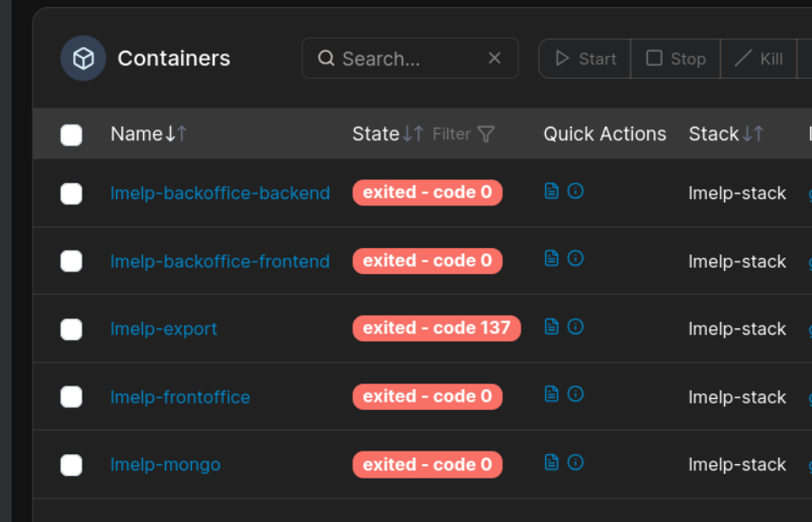
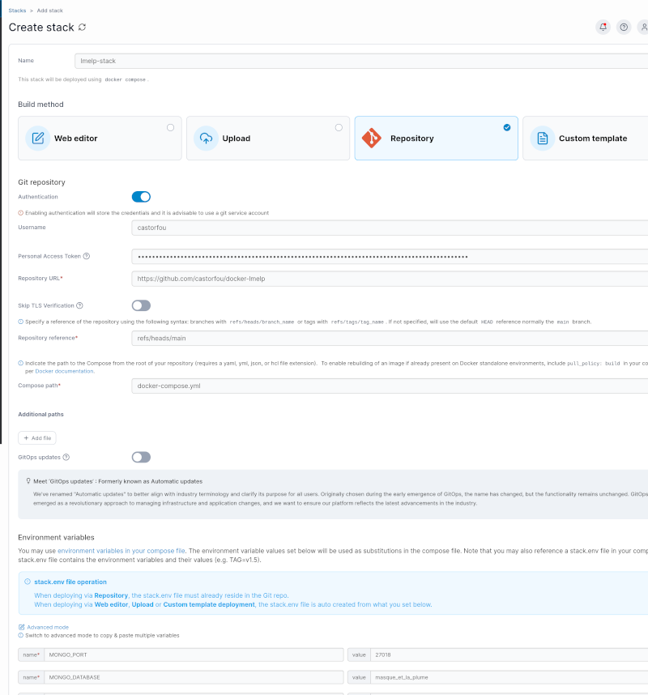
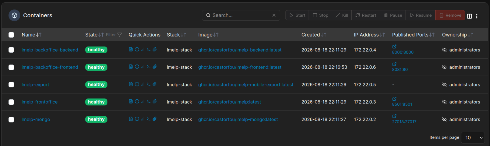
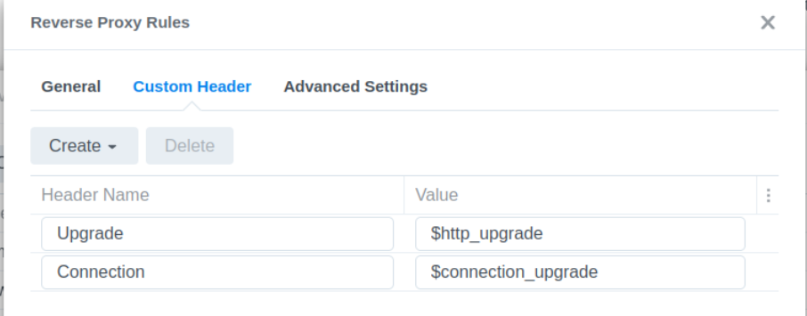

# Migration vers un NAS Synology

Ce guide décrit la migration d'une stack `docker-lmelp` fonctionnant en local sur un
laptop (chemins relatifs `./data/...`) vers un NAS Synology, en conservant les données
existantes (MongoDB, audios, backups, cache Babelio).

!!! info "Déploiement neuf, sans données à migrer ?"
    Ce guide couvre une **migration** (données existantes à transférer). Pour un
    déploiement neuf sur Synology, voir la section "Déploiement sur NAS Synology" de
    [Déploiement Portainer](portainer.md).

## Prérequis

- **Container Manager** installé depuis le Package Center Synology (fournit le moteur
  Docker) et **Portainer** déployé dedans (voir [Déploiement Portainer](portainer.md)).
- **SSH activé** sur le NAS : Panneau de configuration → Terminal & SNMP.
- **Compatibilité des images** : les images `ghcr.io/castorfou/*` utilisées par cette
  stack sont publiées en `amd64` uniquement — vérifier que le NAS est bien un modèle
  x86_64 (`docker manifest inspect <image>` pour confirmer une image donnée).
- **Espace disque** : prévoir l'équivalent du volume actuel de `data/` sur le laptop
  (`du -sh data/*` pour le mesurer — typiquement quelques Go, essentiellement les
  fichiers audio).

## Étape 1 — Préparer l'arborescence sur le NAS

```bash
en tant qu'utilisateur simple (pour moi guillaume uid 1027)

créer depuis DSM (le chemin `/volume1` n'apparait pas) l'arborescence suivante:

- `/docker/lmelp`
- `/docker/{mongodb,backups,audios,logs/lmelp-export,mongodb-logs,cache/babelio,pgx-keys}`
```

!!! info "`pgx-keys` (optionnel, transcription PGX)"
    Répertoire destiné à la clé SSH dédiée à la transcription automatisée via PGX
    (générée et persistée automatiquement au premier démarrage du conteneur `lmelp`, voir
    [Variables PGX](configuration.md#variables-pgx-transcription-automatisee)). À créer
    même si la fonctionnalité n'est pas utilisée immédiatement : sans ce volume, une
    nouvelle clé serait régénérée à chaque recréation du conteneur, invalidant toute
    autorisation SSH déjà déployée côté PGX.

!!! warning "`PGX_HOST` : un nom `.local` qui marche sur laptop peut échouer sur NAS (issue #60)"
    Cas vécu : `PGX_HOST=thinkstationpgx-d7ba.local` fonctionnait depuis le laptop (page
    PGX opérationnelle) mais échouait depuis le conteneur `lmelp` sur le NAS (*"Machine
    joignable — thinkstationpgx-d7ba.local ne répond pas sur le port 22"*), alors qu'un
    `ping` du même nom depuis le laptop répondait normalement. Cause : le conteneur résout
    ce nom via le DNS système hérité de sa machine hôte — le routeur LAN côté laptop
    connaît les baux DHCP locaux et peut résoudre les noms `.local`, alors que le DNS
    configuré dans DSM sur le NAS ne les connaît généralement pas. Voir
    [Variables PGX](configuration.md#variables-pgx-transcription-automatisee) : toujours
    utiliser l'IP directe de PGX pour `PGX_HOST`, jamais un nom `.local` ou un nom court.

!!! warning "`mongodb-logs` ne doit pas être un sous-dossier de `logs` (issue #51)"
    Le conteneur `lmelp` chowne récursivement son propre volume `LOG_PATH` à chaque
    démarrage (utilisateur non-root configurable) — si `mongodb-logs` était imbriqué
    dedans, ça écraserait l'ownership `mongodb` des logs Mongo et casserait les jobs
    anacron (backup/rotation). D'où deux dossiers frères distincts, pas un parent/enfant.

## Étape 2 — Arrêter la stack sur le laptop

Pour migrer un état cohérent des données, arrêter la stack avant le transfert :

Depuis portainer laptop, aller sur la stack lmelp-stack, selectionner tous les containers et cliquer sur Stop




## Étape 3 — Migrer MongoDB (mongodump / mongorestore)

!!! warning "Ne pas `rsync` le dossier `data/mongodb` brut"
    Les fichiers internes de MongoDB (WiredTiger) ne sont pas destinés à être copiés
    tels quels entre deux installations — utiliser `mongodump`/`mongorestore` évite
    tout problème de compatibilité ou de propriétaire de fichiers.

```bash
# Sur le laptop : redémarrer uniquement mongo le temps du dump

# depuis portainer start le container lmelp-mongo

docker exec lmelp-mongo mongodump --db=masque_et_la_plume --out=/backups/migration_nas
sudo chown -R guillaume:guillaume /home/guillaume/git/docker-lmelp/data/backups/migration_nas
# depuis portainer stop le container lmelp-mongo

# Transférer le dump vers le NAS

# depuis DSM, aller dans /docker/lmelp/backups
# creer le repertoire migration_nas/masque_et_la_plume
# upload (Upload - Overwrite) le contenu de /home/guillaume/git/docker-lmelp/data/backups/migration_nas/masque_et_la_plume vers /docker/lmelp/backups/migration_nas/masque_et_la_plume
```

## Étape 4 — Migrer le reste des données (audios, cache)

On passe par une archive zip et
l'interface DSM (File Station) :

```bash
# Depuis le laptop, stack arrêtée
cd /home/guillaume/git/docker-lmelp/data
zip -r audios_cache.zip audios cache
```

Puis, depuis DSM :

1. **File Station** → `/docker/lmelp` → **Upload** → `audios_cache.zip` (10 Go en aout 2026)
2. Clic droit sur `audios_cache.zip` → **Extraire vers...** → `/docker/lmelp` (avec
   écrasement si des fichiers existent déjà)
3. Vérifier l'arborescence obtenue : `/docker/lmelp/audios` et
   `/docker/lmelp/cache/babelio`
4. Supprimer `audios_cache.zip` une fois le contenu vérifié du Nas et du laptop

## Étape 5 — Configurer `.env.nas` pour le NAS

Le repository fournit un template pré-rempli avec les chemins NAS :

```bash
# Sur le laptop, dans le clone du repository
cd /home/guillaume/git/docker-lmelp
cp .env.nas.example .env.nas
nano .env.nas  # compléter les clés API (à recopier depuis le .env du laptop)
```

`.env.nas` est gitignoré au même titre que `.env` (il contient vos vraies clés API) —
seul `.env.nas.example` est versionné.

Points d'attention :

- **Chemins absolus obligatoires** pour Portainer (voir la note dans `CLAUDE.md` sur la
  résolution des chemins relatifs par Portainer) — déjà le cas dans `.env.nas.example`.
- `CALIBRE_HOST_PATH` pointe vers la bibliothèque Calibre-Web-Automated déjà présente
  sur ce NAS (`/volume1/docker/calibre-web-automated/books`), montée en lecture seule.
- `PUID`/`PGID` : câblés dans `docker-compose.yml` pour les services `lmelp` et
  `backend` (utilisateur non-root configurable, castorfou/lmelp#105 et
  castorfou/back-office-lmelp#258). Valeur `1027` déjà renseignée dans
  `.env.nas.example` (UID réel de `guillaume` sur ce NAS) — les fichiers audios/cache
  déjà `root:root` d'un précédent déploiement sont repris automatiquement au prochain
  redémarrage du conteneur, sans manipulation manuelle.

## Étape 6 — Déployer via Portainer

Suivre [Déploiement Portainer](portainer.md), en chargeant le `.env.nas` préparé à l'étape
précédente.


### Créer une nouvelle stack lmelp sur le NAS

1. Se connecter à Portainer
2. Aller dans **Stacks** dans le menu latéral
3. Cliquer sur **+ Add stack**

### Configurer la stack

[](portainer-stack.png)
(cliquer pour zoomer)

**Name** : `lmelp-stack`

**Build method** : Sélectionner **Repository**

**Git Repository** :

```
Authentication: Ne Pas cocher
Repository URL: https://github.com/castorfou/docker-lmelp
Repository reference: refs/heads/main
Compose path: docker-compose.yml
```

**GitOps updates** : Cocher pour detecter les mises a jour de `docker-compose.yml`


**Environment Variables** : Cliquer sur Load variables from .env file et Selectionner le fichier `.env.nas`

### Déployer

1. Vérifier la configuration
2. Cliquer sur **Deploy the stack**

Une fois la stack démarrée, faire un `mongorestore`.


```bash
# Sur le NAS, depuis portainer entrer dans le container lmelp-mongo

mongorestore --db=masque_et_la_plume --drop /backups/migration_nas/masque_et_la_plume
```

### Tester chaque container



En naviguant sur chaque container :

- lmelp : http://nas923:8501/
- backoffice-lmelp : http://nas923:8081/

## Étape 7 — Autoriser la clé SSH PGX

Pour utiliser la transcription automatisée via PGX (voir
[Variables PGX](configuration.md#variables-pgx-transcription-automatisee)), le conteneur
`lmelp` génère automatiquement une clé SSH dédiée à son premier démarrage — cette clé
n'est cependant pas encore autorisée à se connecter sur PGX.

1. Ouvrir la page **PGX** de l'interface Streamlit (`lmelp` → menu PGX) :
   elle affiche la clé publique générée (contenu de `pgx_lmelp_ed25519.pub`) ainsi que la
   commande exacte à exécuter sur PGX pour l'autoriser.
2. Sur PGX, ajouter cette clé publique au `authorized_keys` du compte `PGX_USER` :
   ```bash
   echo '<contenu de la clé publique affichée par la page PGX>' >> ~/.ssh/authorized_keys
   ```
3. Rafraîchir la page PGX (ou cliquer sur **🔄 Relancer les vérifications**) : l'étape
   **Authentification SSH (clé dédiée)** doit passer au vert.

## Étape 8 — Reverse proxy DSM (accès intranet)

Pour un accès via un nom d'hôte sur le réseau local, configurer le reverse proxy natif
DSM : **Portail de connexion** → **Avancé** → **Proxy inversé**.

**lmelp**

- Reverse Proxy Name: lmelp
- Source
    - Protocol: HTTPS
    - Hostname: lmelp.ascot63.synology.me
    - Port: 443
    - Enable HSTS
    - Access control profile: reseau local
- Destination
    - Protocol: HTTP
    - Hostname: localhost
    - Port: 8501

!!! warning "Streamlit nécessite le support WebSocket"
    `lmelp` (Streamlit) communique via WebSocket (`/_stcore/stream`) pour rafraîchir la
    page — sans relai de ces en-têtes, l'application reste bloquée sur un écran de
    chargement vide derrière le reverse proxy (alors qu'un accès direct sur `:8501`
    fonctionne). Éditer la règle **lmelp** → onglet **Custom Header** → **Create** →
    préréglage **WebSocket** (ajoute `Upgrade: $http_upgrade` et
    `Connection: $connection_upgrade`). Pas nécessaire sur `lmelp-bo` (application HTTP
    classique).
    

**backoffice-lmelp**

- Reverse Proxy Name: lmelp-bo
- Source
    - Protocol: HTTPS
    - Hostname: lmelp-bo.ascot63.synology.me
    - Port: 443
    - Enable HSTS
    - Access control profile: reseau local
- Destination
    - Protocol: HTTP
    - Hostname: localhost
    - Port: 8081


## Étape 9 — Valider le déploiement

- [:white_check_mark:] Tous les containers sont `healthy` (`docker compose ps` ou Portainer)
- [:white_check_mark:] L'application LMELP est accessible et affiche les données migrées
- [:white_check_mark:] `docker exec lmelp-mongo mongosh masque_et_la_plume --eval "db.emissions.countDocuments()"` renvoie un nombre cohérent avec l'ancienne installation (fais en root depuis le container lmelp-mongo : `mongosh masque_et_la_plume --eval "db.emissions.countDocuments()"`)
- [:white_check_mark:] Un backup manuel fonctionne (`FORCE_BACKUP=1 /scripts/backup_mongodb.sh`, voir [Backups & Restauration](backup-restore.md))
- [:white_check_mark:] La bibliothèque Calibre est visible depuis le back-office (lecture seule)
- [:white_check_mark:] Le cache Babelio existant est bien pris en compte (pas de re-scraping à froid) :
      1. Vérifier via **File Station** que `/docker/lmelp/cache/babelio` contient bien
         des fichiers `.json` (non vide, cohérent avec ce qui a été zippé/uploadé à
         l'étape 4)
      2. Consulter dans le back-office une fiche livre/auteur déjà vue avant la
         migration : la réponse doit être quasi instantanée (un vrai scraping Babelio
         est ralenti par `BABELIO_FAIR_SEC`, ~2s)
- [:x:] (si utilisé) L'export Android fonctionne depuis le NAS — cf. limitations ci-dessous
- [:white_check_mark:] (si utilisé) La transcription PGX fonctionne : page **PGX** de
  l'interface Streamlit, toutes les étapes de diagnostic au vert (clé SSH autorisée à
  l'étape 7, `PGX_HOST` configuré en IP directe — voir
  [Variables PGX](configuration.md#variables-pgx-transcription-automatisee))

## Limitations connues

- **Export Android (ADB)** : `lmelp-export` se connecte à un serveur ADB en TCP — cela
  nécessite qu'un serveur ADB tourne quelque part joignable par le conteneur (NAS via
  SSH + `platform-tools`, ou conteneur ADB dédié). Le débogage sans fil Android peut être
  instable dans la durée ; réserver une IP DHCP fixe au téléphone est recommandé.
  À valider en conditions réelles sur le NAS. On a documenté cela dans [castorfou/lmelp-mobile#116 - Repenser la séparation mise à jour appli / mise à jour données pour l'export mobile](https://github.com/castorfou/lmelp-mobile/issues/116)
- **Pipeline de transcription PGX** : la transcription automatisée ne dépend plus d'un
  chemin local au laptop — elle passe désormais par SSH depuis le conteneur `lmelp`
  lui-même (voir [Variables PGX](configuration.md#variables-pgx-transcription-automatisee)),
  ce qui fonctionne aussi bien depuis le NAS. Reste à valider en conditions réelles une
  fois `lmelp` déployé sur le NAS (station PGX joignable sur le même réseau local que le
  NAS, clé SSH dédiée à autoriser côté PGX).
- **Contournement réseau Babelio non transférable au NAS** : c'est le conteneur
  `backend` (pas le navigateur) qui interroge Babelio pour enrichir les métadonnées.
  Quand Babelio bloque/rate-limite ou exige une IP spécifique, la solution actuelle est
  de changer de réseau/VPN **au niveau OS du laptop** — un contournement propre à cette
  machine précise, qui ne s'applique plus une fois le `backend` déplacé sur le NAS. Pas
  de solution équivalente côté NAS pour l'instant (suivi dans
  [castorfou/back-office-lmelp#259 - Support d'un proxy HTTP sortant pour les requêtes vers Babelio](https://github.com/castorfou/back-office-lmelp/issues/259)).
- **Logs backup/logrotate mongo (anacron) absents ou mal ownés** : `/var/log/mongodb/backup.log`
  et `logrotate.log` n'apparaissent pas sur le NAS malgré des jobs anacron bien
  déclenchés (`chown -R mongodb:mongodb` manuel dans la console du conteneur débloque
  la situation en attendant). Même symptôme d'ownership incohérent (`ubuntu` au lieu de
  `mongodb`) reproduit sur le laptop — donc pas spécifique à la migration NAS. Root
  cause non tranchée (nécessite un accès Docker direct pour investiguer) : suivi dans
  [castorfou/docker-lmelp#51 - Logs backup/logrotate mongo (anacron) : ownership incohérent (ubuntu au lieu de mongodb), absents sur NAS](https://github.com/castorfou/docker-lmelp/issues/51).

## Sous-issues liées

| Sous-issue                                                                                   | Sujet                                                                   | Statut    |
| -------------------------------------------------------------------------------------------- | ----------------------------------------------------------------------- | --------- |
| [castorfou/docker-lmelp#48](https://github.com/castorfou/docker-lmelp/issues/48)             | Anacron mongo écrit les backups/logs en root                            | ✅ Fermée  |
| [castorfou/back-office-lmelp#258](https://github.com/castorfou/back-office-lmelp/issues/258) | Conteneur backend tourne en root (cache Babelio)                        | ✅ Fermée  |
| [castorfou/back-office-lmelp#259](https://github.com/castorfou/back-office-lmelp/issues/259) | Support proxy HTTP sortant pour Babelio                                 | 🔵 Ouverte |
| [castorfou/lmelp#105](https://github.com/castorfou/lmelp/issues/105)                         | Conteneur lmelp tourne en root (audios/transcriptions)                  | ✅ Fermée  |
| [castorfou/lmelp-mobile#116](https://github.com/castorfou/lmelp-mobile/issues/116)           | Repenser séparation appli/données + ADB NAS                             | 🔵 Ouverte |
| [castorfou/lmelp-mobile#117](https://github.com/castorfou/lmelp-mobile/issues/117)           | Adapter le pipeline Whisper/PGX au NAS                                  | 🔵 Ouverte |
| [castorfou/back-office-lmelp#261](https://github.com/castorfou/back-office-lmelp/issues/261) | Intégration Calibre échoue en lecture seule sur bibliothèque WAL active | ✅ Fermée  |
| [castorfou/docker-lmelp#51](https://github.com/castorfou/docker-lmelp/issues/51)             | Logs backup/logrotate mongo (anacron) : ownership incohérent            | 🔵 Ouverte |


## Historique

Ce guide fait suite à l'investigation menée dans
[l'issue #47](https://github.com/castorfou/docker-lmelp/issues/47), qui documente les
décisions prises point par point.
