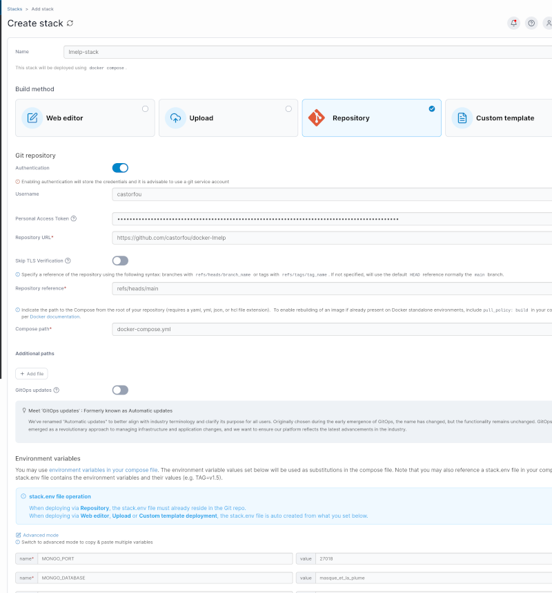

# Déploiement avec Portainer

Ce guide explique comment déployer la stack LMELP via l'interface web Portainer, une alternative graphique au déploiement en ligne de commande.

## Prérequis

- Portainer installé et accessible
- Repository `docker-lmelp` cloné ou fichiers disponibles localement
- Fichier `.env` configuré avec vos valeurs

## Avantages de Portainer

- **Interface graphique** : Gestion visuelle des containers et stacks
- **Monitoring** : Vue en temps réel de l'état des services
- **Logs centralisés** : Accès facile aux logs de chaque container
- **Gestion des ressources** : Monitoring CPU, RAM, réseau
- **Mise à jour simplifiée** : Redéploiement en un clic

## Accéder à Portainer

Ouvrir Portainer dans votre navigateur :

- **Local** : `https://localhost:9443`
- **NAS/Serveur distant** : `https://nas-ip:9443`

**Première connexion** :

1. Créer un compte administrateur
2. Sélectionner "Docker" comme environnement
3. Choisir "Local" ou "Remote" selon votre installation

## Déploiement via Repository Git

### Étape 1 : Créer une nouvelle stack

1. Se connecter à Portainer
2. Aller dans **Stacks** dans le menu latéral
3. Cliquer sur **+ Add stack**

### Étape 2 : Configurer la stack

[](portainer-stack.png)
(cliquer pour zoomer)

**Name** : `lmelp-stack`

**Build method** : Sélectionner **Repository**

**Git Repository** :

```
Authentication: Coche
Username: castorfou
Personal Access Token: <voir dans enpass: github personal access tokens>
Repository URL: https://github.com/castorfou/docker-lmelp
Repository reference: refs/heads/main
Compose path: docker-compose.yml
```

**GitOps updates** : Cocher pour detecter les mises a jour de `docker-compose.yml`


**Environment Variables** : Cliquer sur Load variables from .env file et Selectionner le fichier `.env`

### Étape 3 : Déployer

1. Vérifier la configuration
2. Cocher **Pull latest image versions** (recommandé)
3. Cliquer sur **Deploy the stack**

Portainer va :

- Cloner le repository
- Télécharger les images Docker
- Créer les volumes
- Démarrer les containers

### Étape 4 : Vérifier le déploiement

Aller dans **Stacks** → **lmelp-stack** pour voir :

- Liste des services (`lmelp-mongo`, `lmelp-frontoffice`, `lmelp-backoffice-frontend`, `lmelp-backoffice-backend`)
- État de chaque container (vert = healthy)
- Logs en temps réel


## Gestion de la stack dans Portainer

### Voir l'état des containers

**Stacks** → **lmelp-stack** :

- **lmelp-backoffice-backend** : ⬤ healthy
- **lmelp-backoffice-frontend** : ⬤ healthy
- **lmelp-frontoffice** : ⬤ healthy
- **lmelp-mongo** : ⬤ healthy

### Consulter les logs

1. **Stacks** → **lmelp-stack**
2. Cliquer sur un service (ex: `lmelp-mongo`)
3. Onglet **Logs**
4. Activer **Auto-refresh** pour mise à jour automatique

### Redémarrer un service

1. **Stacks** → **lmelp-stack**
2. Cocher le service à redémarrer
3. Cliquer sur **Restart**

**Redémarrer toute la stack** :

Depuis la page de la stack, cliquer sur **Stop this stack** puis **Start this stack**.

### Monitoring des ressources

1. **Stacks** → **lmelp-stack**
2. Cliquer sur un service
3. Onglet **Stats** : graphiques de CPU, RAM, I/O réseau et disque

### Accéder à la console d'un container

1. **Stacks** → **lmelp-stack**
2. Cliquer sur un service
3. Onglet **Console**
4. Sélectionner `/bin/bash` ou `/bin/sh`
5. Cliquer sur **Connect**

Exemple - Exécuter une restauration :

```bash
# Dans la console du container mongo-backup
/scripts/restore_mongodb.sh backup_2024-11-21_02-00-00
```

## Mise à jour de la stack

### Mise à jour des images Docker

1. **Stacks** → **lmelp-stack**
2. Cliquer sur **Pull and redeploy**
3. Cocher **Re-pull image**
4. Cliquer sur **Update**

Portainer va :

- Télécharger les dernières images
- Arrêter les containers existants
- Recréer les containers avec les nouvelles images
- Conserver les volumes (données préservées)

### Mise à jour de la configuration

**Modifier les variables d'environnement** :

1. **Stacks** → **lmelp-stack**
2. Onglet **Environment variables**
3. Modifier ou ajouter des variables
4. Cliquer sur **Update the stack**

**Modifier le docker-compose.yml** :

1. **Stacks** → **lmelp-stack**
2. Onglet **Editor**
3. Modifier le fichier YAML
4. Cliquer sur **Update the stack**

## Gestion des volumes

### Voir les volumes

1. **Volumes** dans le menu latéral
2. Rechercher `lmelp`

Volumes créés :

- Volumes Docker pour MongoDB data, backups, audios, logs
- Ou bind mounts vers `./data/` selon la configuration

## Surveillance et alertes

### Notifications Portainer

Configurer des notifications pour surveiller la stack :

1. **Settings** → **Notifications**
2. Ajouter un webhook (Slack, Discord, Email, etc.)
3. Configurer des alertes pour :
   - Container down
   - Resource limits exceeded
   - Failed deployments

### Monitoring externe

Intégrer avec des outils externes :

- **Prometheus + Grafana** : Métriques détaillées
- **cAdvisor** : Monitoring des containers
- **Netdata** : Monitoring système en temps réel

## Déploiement sur NAS Synology

### Prérequis Synology

1. Installer **Container Manager** depuis Package Center
2. Activer SSH dans **Panneau de configuration** → **Terminal & SNMP**
3. Se connecter via SSH : `ssh admin@nas-ip`

### Étapes spécifiques

1. Créer les dossiers de données :

```bash
# Se connecter au NAS
ssh admin@nas-ip

# Créer la structure
sudo mkdir -p /volume1/docker/lmelp/{mongodb,backups,audios,logs,scripts,cron}
```

2. Copier les fichiers :

```bash
# Depuis votre machine locale
scp -r scripts/* admin@nas-ip:/volume1/docker/lmelp/scripts/
scp cron/backup-cron admin@nas-ip:/volume1/docker/lmelp/cron/
```

3. Déployer via Portainer (Container Manager → Portainer)

4. Adapter `.env` pour Synology :

```bash
# Chemins absolus pour Synology
MONGO_DATA_PATH=/volume1/docker/lmelp/mongodb
BACKUP_PATH=/volume1/docker/lmelp/backups
AUDIO_PATH=/volume1/docker/lmelp/audios
LOG_PATH=/volume1/docker/lmelp/logs

# Réseau en mode host
DB_HOST=localhost
```

## Dépannage

### La stack ne démarre pas

1. Vérifier les logs depuis Portainer
2. Vérifier les variables d'environnement
3. Vérifier que les volumes sont accessibles
4. Vérifier les ports disponibles

### Un container est en erreur

1. **Stacks** → **lmelp-stack** → cliquer sur le container en erreur
2. Onglet **Logs** : identifier l'erreur
3. Onglet **Inspect** : vérifier la configuration
4. Redémarrer le container

### Problèmes de permissions

```bash
# Se connecter à l'hôte
ssh user@server

# Vérifier et corriger les permissions
sudo chown -R 1000:1000 /path/to/data/
sudo chmod -R 755 /path/to/data/
```

### Impossible d'accéder à l'application

1. Vérifier que les containers sont running
2. Vérifier les ports dans **Container details**
3. Vérifier les règles firewall de l'hôte
4. Tester depuis l'hôte : `curl http://localhost:8501`

## Sécurité

### Protéger Portainer

- **Activer HTTPS** : Settings → SSL certificate
- **Authentification forte** : Settings → Authentication → Activer 2FA
- **Limiter l'accès réseau** : Utiliser un reverse proxy (Nginx, Traefik)

### Protéger les secrets

Ne jamais exposer `.env` via Git :

- Uploader `.env` uniquement via l'interface Portainer
- Utiliser Docker secrets pour les valeurs sensibles
- Activer les restrictions d'accès aux variables dans Portainer

## Prochaines étapes

- [Installation](installation.md) : Prérequis et installation initiale
- [Configuration](configuration.md) : Détails sur les variables
- [Gestion des backups](backup-restore.md) : Sauvegarder et restaurer
